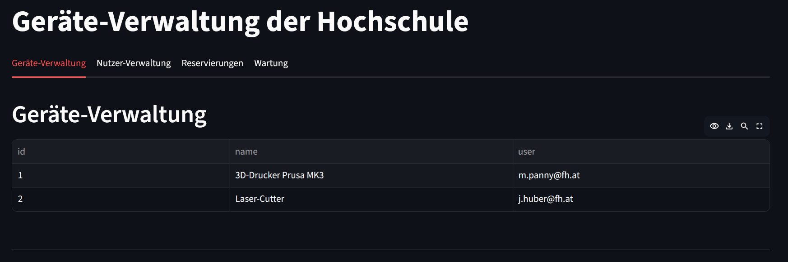
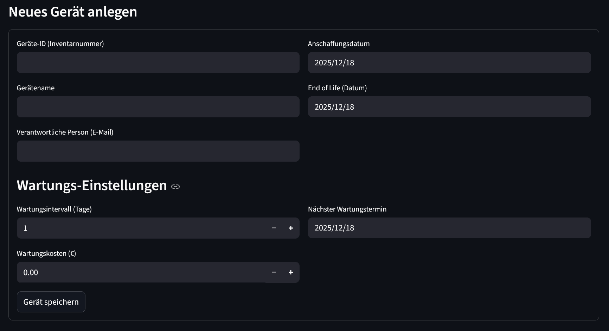

# Case Study 01 - Geräteverwaltung

**Team:** Simen Cherubin, Florian Herzog

## Projektbeschreibung
Dieses Projekt implementiert eine Geräteverwaltung für Hochschulen mittels Streamlit (Python).

## Setup & Start

1. Repository klonen:
git clone <https://github.com/florian-her/Case_Study_01.git>

2. Virtuelle Umgebung erstellen (Windows):
python -m venv .venv
source .venv/Scripts/activate

3. Abhängigkeiten installieren:
pip install -r requirements.txt

4. App starten:
streamlit run main.py

## UI Mockups (Abgabe I)

### 1. Geräte-Übersicht

### 2. Geräte-Verwaltung

### 3. Nutzer-Verwaltung

